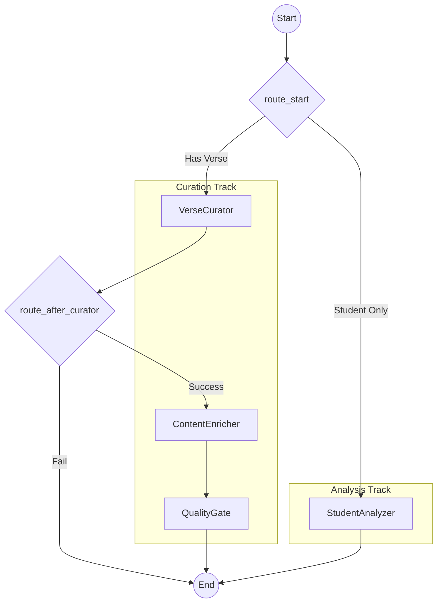

# Sanskrit Karaoke — Teaching Pipeline

This directory contains the server-side agentic pipeline for verse curation and student analysis, built using **LangGraph 1.0** and **Pydantic**.

## Architecture

The pipeline consists of four primary nodes and two decision routers. It is persistent (using `SqliteSaver` or `PostgresSaver`) and type-safe (using Pydantic models).



### Nodes

1.  **VerseCurator**: Coerces input data into a `VerseData` Pydantic model. Enforces basic mandatory fields (`id`, `s1`, `s2`, `encoding`).
2.  **ContentEnricher**: A tool-using node that calls Gemini Flash (or Anthropic) to generate missing Russian translations and relevant tags.
3.  **QualityGate**: The final validation gate. Checks for:
    *   Meter identification (must not be "unknown").
    *   Translation presence (RU or EN).
    *   ID uniqueness (checks `verses/index.json`).
    *   Script integrity (IAST character validation).
4.  **StudentAnalyzer**: Analyzes SRS history (spaced repetition) to recommend due verses and new verses based on current student difficulty levels.

## Running Tests

### Simulation
Run a full simulation of the pipeline (Curation + Student Analysis):
```bash
python agents/teaching_pipeline/test_simulation.py
```

### Deepcopy Verification
Verify that nodes do not mutate state in-place (essential for LangGraph persistence):
```bash
python agents/teaching_pipeline/test_deepcopy.py
```

## Evals
The pipeline is continuously evaluated using a **Golden Dataset** (8 cases) in `evals/judge.py`.

```bash
python evals/judge.py
```
