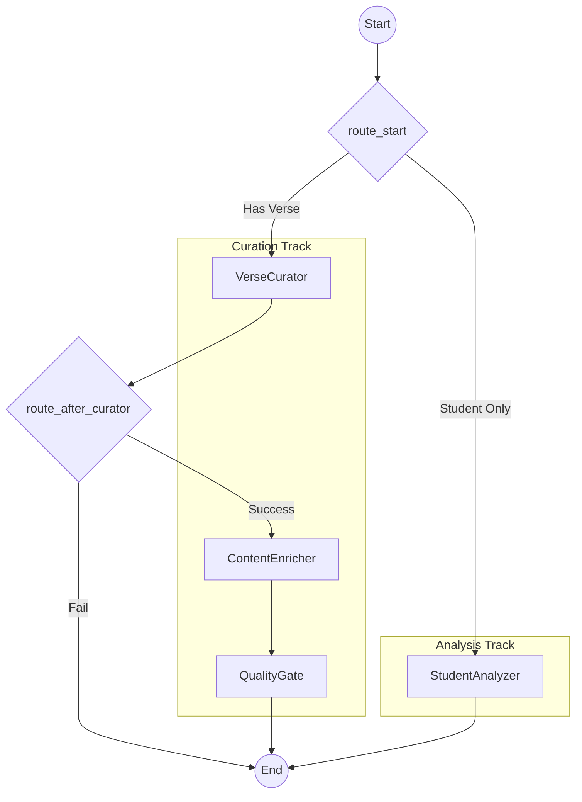

_Created: 15-05-2026 · Last updated: 05-09-2026_

# Sanskrit Karaoke — Teaching Pipeline

This directory contains the server-side agentic pipeline for verse curation and student analysis, built using **LangGraph 1.0** and **Pydantic**.

## Architecture

The pipeline consists of four primary nodes and two decision routers. It is persistent (using `SqliteSaver` or `PostgresSaver`) and type-safe (using Pydantic models).


```mermaid
graph TD
    Start((Start)) --> Route1{route_start}
    
    Route1 -- "Has Verse" --> Curator[VerseCurator]
    Route1 -- "Student Only" --> Analyzer[StudentAnalyzer]
    
    Curator --> Route2{route_after_curator}
    Route2 -- "Success" --> Enricher[ContentEnricher]
    Route2 -- "Fail" --> End((End))
    
    Enricher --> Gate[QualityGate]
    Gate --> End
    
    Analyzer --> End
    
    subgraph "Curation Track"
        Curator
        Enricher
        Gate
    end
    
    subgraph "Analysis Track"
        Analyzer
    end
```

### Nodes

1.  **VerseCurator**: Coerces input data into a `VerseData` Pydantic model. Enforces basic mandatory fields (`id`, `s1`, `s2`, `encoding`).
2.  **ContentEnricher**: A tool-using node that calls Gemini Flash (or Anthropic) to generate missing Russian translations and relevant tags.
3.  **QualityGate**: The final validation gate. Checks for:
    *   Meter identification (must not be "unknown").
    *   Translation presence (RU or EN).
    *   ID uniqueness (checks `verses/index.json`).
    *   Script integrity (IAST character validation).
4.  **StudentAnalyzer**: Analyzes SRS history (spaced repetition) to recommend due verses and new verses based on current student difficulty levels.

## Running Tests

### Simulation
Run a full simulation of the pipeline (Curation + Student Analysis):
```bash
python agents/teaching_pipeline/test_simulation.py
```

### Deepcopy Verification
Verify that nodes do not mutate state in-place (essential for LangGraph persistence):
```bash
python agents/teaching_pipeline/test_deepcopy.py
```

## LangSmith tracing

Phase 2 of [MY_ROADMAP.md](https://github.com/gasyoun/SanskritKaraoke/blob/main/MY_ROADMAP.md) asks for a LangSmith trace of a full
verse-to-catalogue run. Tracing is env-native — LangChain reads `LANGSMITH_*`:

1. Copy `.env.example` → `.env` and fill the `LANGSMITH` section (free token:
   [smith.langchain.com](https://smith.langchain.com) → Settings → Personal Access Tokens).
2. `python agents/teaching_pipeline/trace_probe.py` — checks the environment, runs the
   simulation once, and reports whether tracing is ACTIVE.
3. Open the project in LangSmith, copy the trace URL, paste it into the Phase 2 checklist.

Without `.env` values the probe reports exactly what to set and exits 0.

## Evals
The pipeline is continuously evaluated using a **Golden Dataset** (8 cases) in `evals/judge.py`.

```bash
python evals/judge.py
```

_Dr. Mārcis Gasūns_
